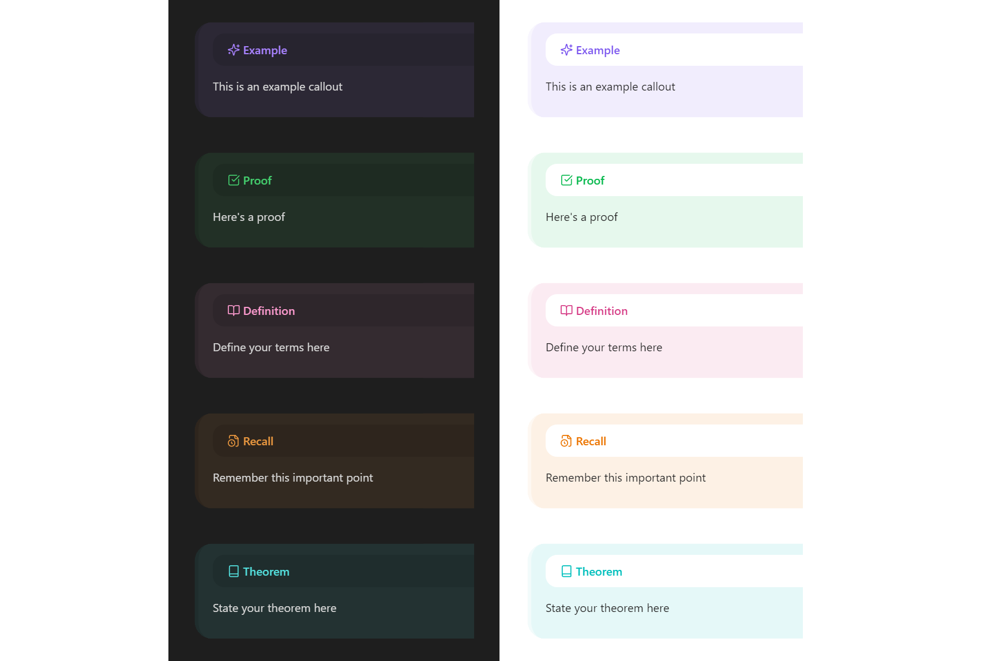
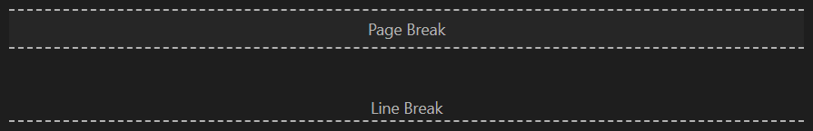
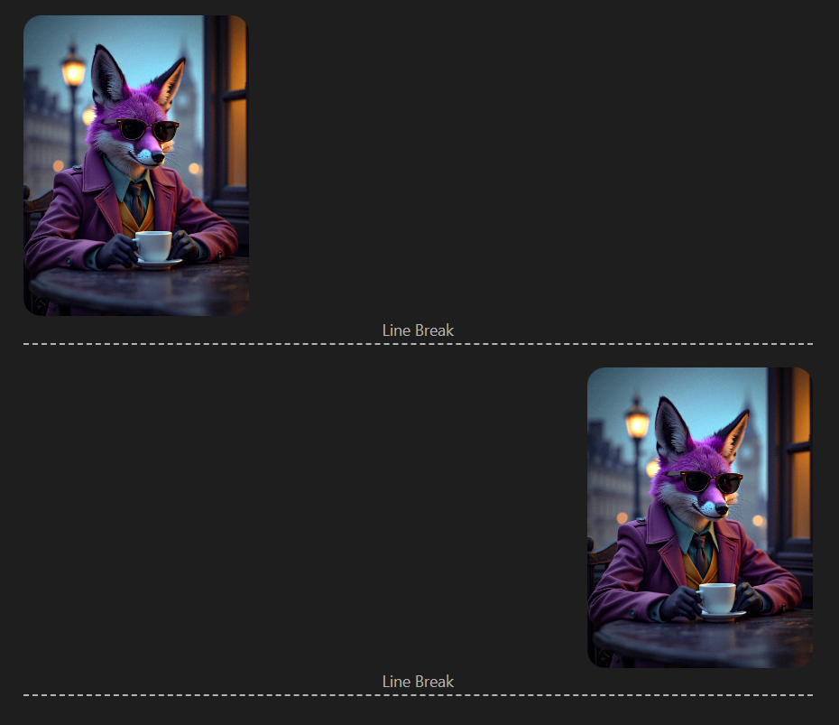
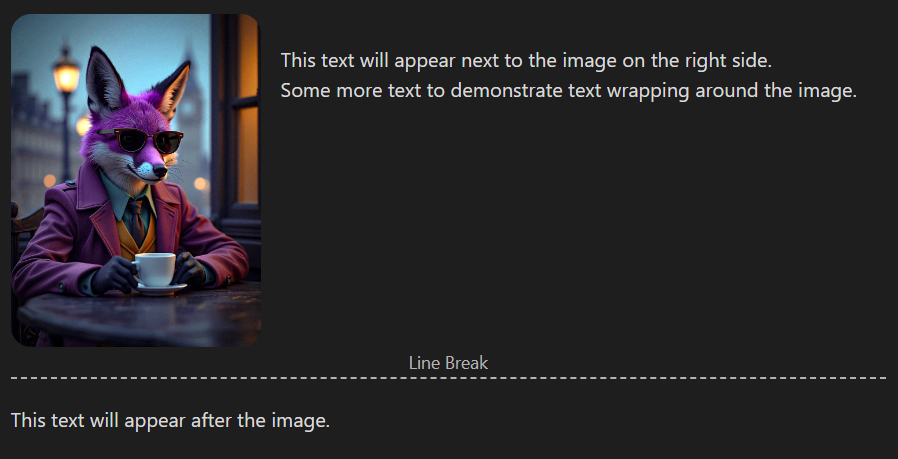
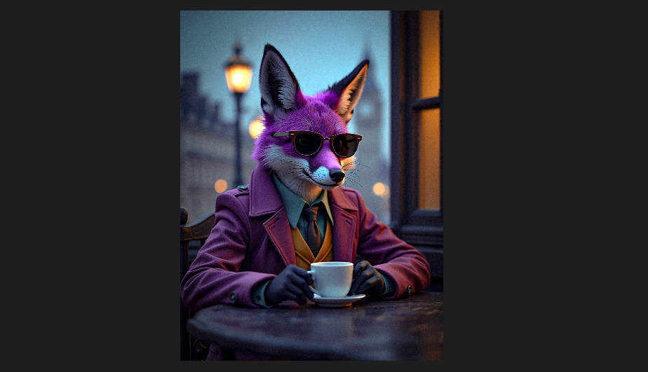
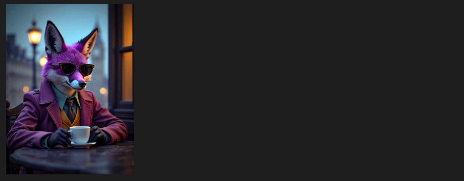

# Purple Fox Notes

A stylish theme that enhances your note-taking experience in Obsidian with beautiful styling and additional functionality.

## Features

### Custom Callouts

Purple Fox Notes comes with several beautifully styled custom callouts:

- `example` - For demonstrating concepts with a sparkles icon ✨
- `proof` - For mathematical or logical proofs with a check-square icon ✅
- `definition` - For defining terms and concepts with a book-open icon 📖
- `recall` - For memory aids and review points with a file-clock icon 🕒
- `theorem` - For stating important theorems with a book icon 📚
- `lemma` - For supporting statements used in proofs with a bookmark icon 🔖

Example usage:
```md
> [!example]
> This is an example callout

> [!proof]
> Here's a proof

> [!definition]
> Define your terms here

> [!recall]
> Remember this important point

> [!theorem]
> State your theorem here

> [!lemma]
> State your lemma here
```




### Hidden Callout Titles

You can hide the title of any callout by adding `notitle` to the callout:

```md
> [!example notitle]
> This example will not show the "Example" title at the top
```


### Page and Line Breaks

Purple Fox Notes provides elegant ways to add page and line breaks to your notes:

- Use the ribbon icons (if enabled) to insert page or line breaks
- Use the command palette and search for "Insert Page Break" or "Insert Line Break"
- Page breaks are visible as dashed lines in edit mode but create actual page breaks in PDF exports
- Line breaks provide visual separation without causing page breaks in exports

Example of page and line breaks in edit mode:



These breaks help organize your content and control document flow, especially useful when preparing for PDF export.

### Image Formatting

Purple Fox Notes supports various image formatting options:

- **Image Alignment**: Use `left` or `right` to align images.
    ```md
    ![[image.png|left|200]]

    <div class="line-break"></div>
    
    ![[image.png|right|200]]

    <div class="line-break"></div>
    ```

Note: When using aligned images, always insert a line break after the image, with an empty line between them, to ensure proper text flow.



- **Text Alongside Images**: Add text before the line break to have it flow alongside the image:
    ```md
    ![[image.png|left|200]]
    This text will appear next to the image on the right side.
    Some more text to demonstrate text wrapping around the image.

    <div class="line-break"></div>
    
    This text will appear after the image.
    ```




- **Border Radius**: Add `no-radius` to remove rounded corners from images
  ```md
  ![[image.png|no-radius|300]]
  ```


- **Image Resizing**: Add a number at the end to resize the image (in pixels)
  ```md
  ![[image.png|200]]
  ```

- **Combining Options**: You can combine multiple options, but the size must always be last
  ```md
  ![[image.png|left no-radius|200]]
  ```


### Additional Style Enhancements
- Beautiful table styling with centered content and rounded corners
- Responsive and clean design for both light and dark themes
- Enhanced callout styling with smooth borders and elegant backgrounds


## License

This project is licensed under the MIT License - see the [LICENSE](LICENSE) file for details.

---

Created by [Yahya Izadi](https://github.com/yahaiz)